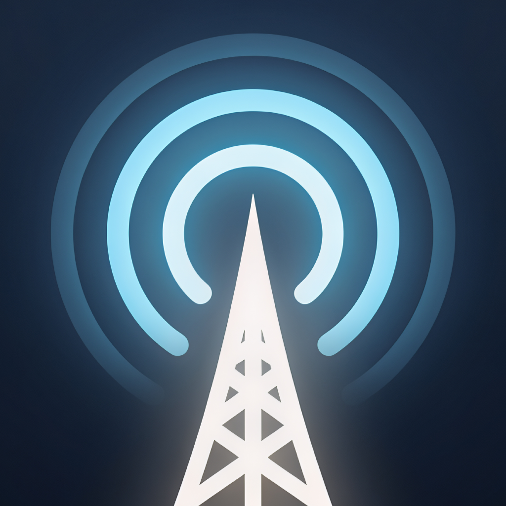
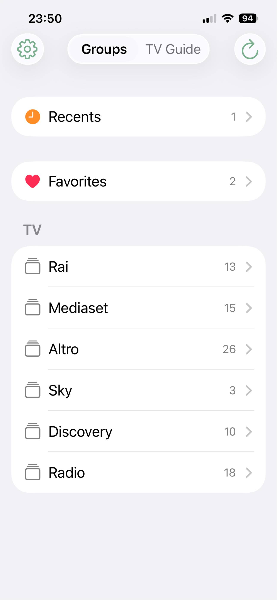
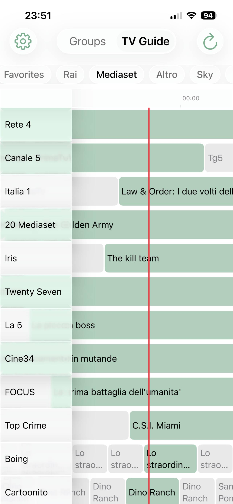
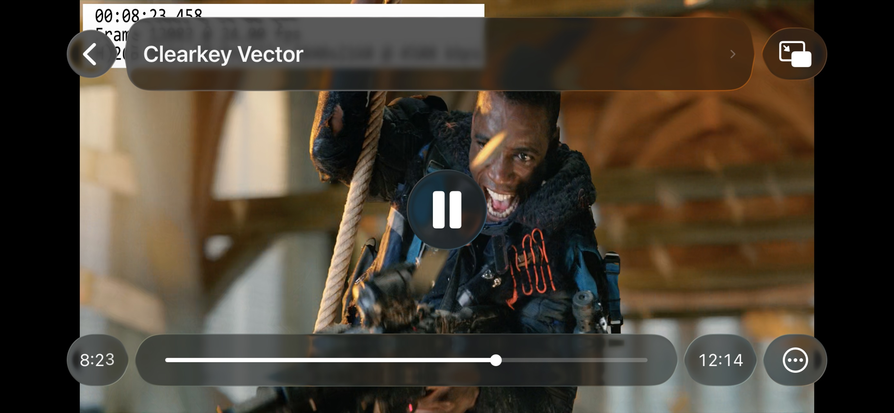
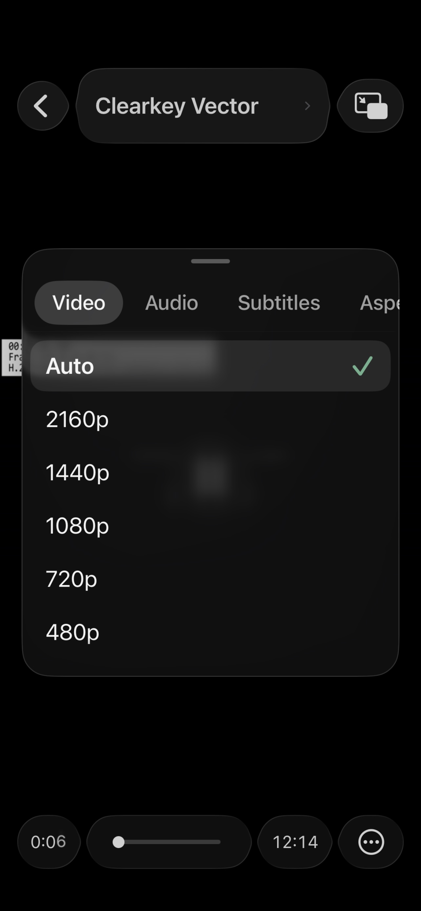

<div align="center">
  
  <h1>ClearPlayer</h1>
  <p>
    A DASH (MPD) and HLS player for iPhone and iPad<br>
    with <b>ClearKey</b> support
  </p>
  <p>
    <a href="https://apps.apple.com/it/app/clearplayer-clearkey-iptv/id6800097255">
      
    </a>
  </p>
  <p>
    <a href="https://t.me/clearplayerapp">
      
    </a>
  </p>
</div>

ClearPlayer plays MPEG-DASH and HLS streams — live and on demand — including ClearKey-encrypted ones, with keys read directly from your playlist. It was built because iOS has no good option for this: WebKit breaks on several kinds of real-world DASH streams, and working around those breakages is most of what this app does.

This repository holds the documentation and the issue tracker. The app itself is closed source.

<!---

## Screenshots

| Channels | TV guide | Player | Track selection |
|---|---|---|---|
|  |  |  |  |

--->

## What it is

A player. You bring your own sources — M3U/M3U8 playlists, XMLTV guides, or Xtream Codes credentials — and ClearPlayer plays them.

## What it is not

ClearPlayer ships with **no content of any kind**. No channels, no playlists, no preconfigured servers, no directory of streams. There is nothing to watch until you add your own source, and the app cannot help you find one.

---

## Features

**Playback**
- MPEG-DASH (`.mpd`) and HLS (`.m3u8`), live and VOD
- ClearKey decryption, keys read from `#KODIPROP` tags in the playlist
- Manual selection of video quality, audio track and subtitle track
- Codec, bitrate and resolution readout for the active stream
- DVR seeking on live streams, with return-to-live
- Picture in Picture, background audio, AirPlay (not for mpd)
- HEVC where the stream offers it

**Playlists**
- Multiple M3U/M3U8 playlists, local or remote
- Gzip-compressed playlists
- Channel groups from `group-title`
- Automatic refresh at a configurable interval

**Electronic programme guide**
- XMLTV, multiple sources with a user-defined priority order
- Gzip and xz compressed guides
- Auto-discovery of guide URLs from a playlist's `x-tvg-url` header, including multiple comma-separated URLs
- Full-screen guide grid, plus an in-player guide over the video
- Programme details with description and timing

**Xtream Codes**
- Live categories and streams via the Xtream Codes API
- Credentials stored in the iOS Keychain
- Guide data through the provider's `xmltv.php` endpoint

**Sharing**
- Send a playlist to another device as an end-to-end encrypted text code
- Optional *Hide URL* mode: the recipient can watch the playlist without ever seeing its address

---

## Requirements

- iOS or iPadOS 26.0 or later
- iPhone or iPad

---

## Getting started

1. Open **Playlists** and tap **Add**.
2. Paste the URL of an M3U/M3U8 playlist, or pick a file from your device.
3. Give it a name, or accept the one derived from the source domain.
4. Wait for the channel list to load, then pick a channel.

Guide sources are added the same way, under **EPG sources**. If your playlist declares an `x-tvg-url` header, ClearPlayer offers to add those automatically.

---

## ClearKey in playlists

ClearPlayer reads decryption keys from `#KODIPROP` tags, the same syntax used by Kodi's `inputstream.adaptive`. Put them on the lines immediately before the channel entry:

```
#KODIPROP:inputstream.adaptive.license_type=org.w3.clearkey
#KODIPROP:inputstream.adaptive.license_key=1a2b3c4d5e6f708192a3b4c5d6e7f809:0f1e2d3c4b5a69788796a5b4c3d2e1f0
#EXTINF:-1 tvg-id="example.channel" tvg-logo="https://example.com/logo.png" group-title="Example",Example Channel
https://example.com/stream/manifest.mpd
```

Both the KID and the key are 32 hexadecimal characters. For streams that use several keys, separate the pairs with commas:

```
#KODIPROP:inputstream.adaptive.license_key=<kid1>:<key1>,<kid2>:<key2>
```

Unencrypted channels need no `#KODIPROP` lines at all.

---

## Known limitations

- **Widevine and PlayReady are not supported** and will not be. ClearKey only.
- Some live DASH streams still fail on iOS despite the workarounds below. If you have one, please report it — see the next section.
- The guide grid can be heavy on very large channel groups.
- No tvOS or macOS build at the moment.

---

## Reporting a stream that will not play

Broken streams are the most useful thing you can send. Open an issue with the **Stream not playing** template and include:

- what kind of stream it is (DASH or HLS, live or VOD, encrypted or not)
- the exact error the app shows
- your device model and iOS version
- the manifest URL, if it is publicly reachable

**Please do not post keys, credentials, or URLs belonging to a subscription service.** Issues containing them will be deleted. If your stream is private and you would still like it looked at, get in touch by email instead — the address is in the app under Settings.

---

## Privacy

Playlists, guide sources and settings stay on your device. Xtream credentials and hidden playlist URLs are kept in the iOS Keychain. ClearPlayer has no account system and no server of its own: it talks only to the sources you add.

The app includes Firebase Crashlytics and Analytics for crash reports and anonymous usage statistics.

---

## Changelog

See [CHANGELOG.md](CHANGELOG.md).

---

## Legal

ClearPlayer is a media player. It does not provide, host, index, or bundle any audio or video content, and it does not include any means of discovering content. You are responsible for the sources you add and for holding the rights to access them.

The application is proprietary. This repository contains documentation only and is published under no open source licence.
