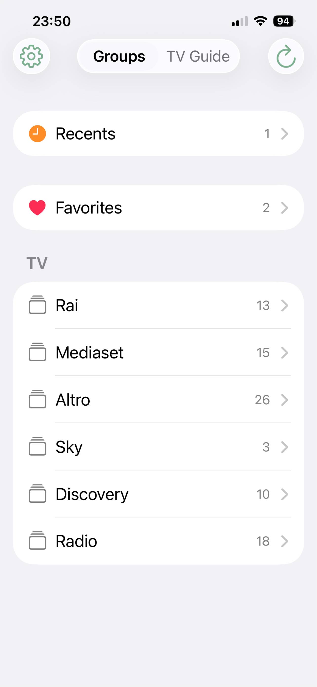
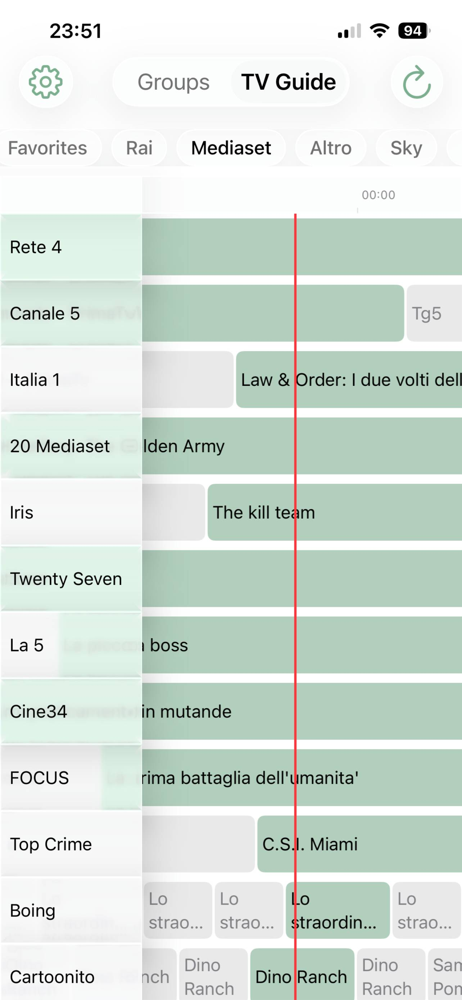
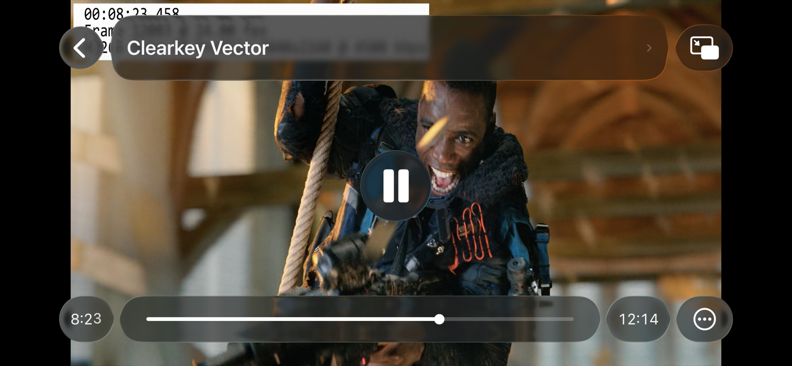
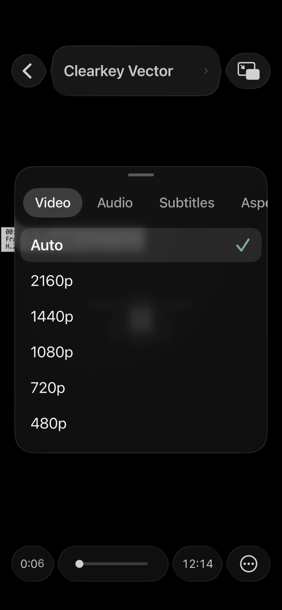

<div align="center">
  
  <h1>ClearPlayer</h1>
  <p>
    A high-performance DASH (MPD) and HLS player for iPhone, iPad, macOS, and Apple TV<br>
    with <b>ClearKey</b> support
  </p>
  <p>
    <a href="https://apps.apple.com/it/app/clearplayer-clearkey-iptv/id6800097255">
      
    </a>
  </p>
  <p>
    <a href="https://t.me/clearplayerapp">
      
    </a>
  </p>
</div>

ClearPlayer plays MPEG-DASH and HLS streams — live and on demand — including ClearKey-encrypted ones, with keys read directly from your playlist. It was built because iOS has no good option for this: WebKit breaks on several kinds of real-world DASH streams, and working around those breakages is most of what this app does.

This repository holds the documentation and the issue tracker. The app itself is closed source.

<!---

## Screenshots

| Channels | TV guide | Player | Track selection |
|---|---|---|---|
|  |  |  |  |

--->

## What it is

A media player. You bring your own sources — M3U/M3U8 playlists, local files, XMLTV guides, Xtream Codes credentials, or single stream URLs — and ClearPlayer plays them.

## What it is not

ClearPlayer ships with **no content of any kind**. No channels, no playlists, no preconfigured servers, and no directory of streams. There is nothing to watch until you provide your own source, and the app cannot help you find one.

---

## Features

### Playback & DRM
- **Dual Playback Engine**: High-performance Native engine with real-time local proxy decryption, alongside a Legacy engine fallback on iOS; 100% native engine on tvOS.
- **MPEG-DASH (`.mpd`) & HLS (`.m3u8`)**: Live streams, DVR time-shifted streams, and VOD.
- **Quick Play**: Instantly paste and play any raw stream URL, manifest, or M3U snippet with keys without saving a playlist.
- **Stream Info & Diagnostics**: Real-time technical readout of resolution, frame rate, dynamic range (HDR10, HLG, Dolby Vision, SDR), video/audio codecs, audio channels, and bitrate.
- **Quality & Buffer Control**: Manual selection of video track, audio language, and subtitles; configurable forward buffer duration (0s to 30s) and preferred starting resolution.
- **DVR Live Seeking**: Full scrub bar seeking on live streams with return-to-live button, customized for touch and the Apple TV Siri Remote.
- **System Integration**: Picture-in-Picture (PiP), background audio playback, and AirPlay.

### Playlists & Organisation
- **Multiple Sources**: Remote URLs, local file imports (`.m3u`, `.m3u8`) from the Files app, or Xtream Codes.
- **Group Management**: Reorder and hide channel categories (with bulk *Hide All* / *Show All*); hidden groups are automatically excluded from both channel lists and the EPG grid.
- **Channel Search v2**: Instant, real-time search across channels and groups.
- **Rich Tag Support**: Full parsing of `#EXTGRP`, `#EXTHTTP` (per-channel custom JSON headers), `#EXTVLCOPT` (User-Agent and Referer), `#KODIPROP:inputstream.adaptive.stream_headers`, SVG channel logos, and `url-logo`.
- **Smart Refresh**: Playlists can be temporarily disabled; re-enabling triggers an automatic background refresh to renew transient CDN streaming tokens.

### Electronic Programme Guide (EPG)
- **XMLTV Support**: Multiple sources with user-defined priority order, supporting plain, `.gz`, and `.xz` compressed guides.
- **Auto-Discovery**: Automatic detection of guide URLs from the playlist's `x-tvg-url` tag (including comma-separated lists).
- **Multiple Views**: Full-screen TV guide grid, in-player overlay guide, and a dedicated 10-foot grid for Apple TV.
- **Synchronised Categories**: Guide grid automatically reflects your custom group order and hidden group preferences.

### Xtream Codes
- Full live categories, channels, and EPG (`xmltv.php`) integration.
- Secure storage of credentials in the iOS / tvOS Keychain.
- Full support on iPhone, iPad, and Apple TV.

### End-to-End Encrypted Sharing
- **Secure Codec (HPKE)**: Transfer playlists or Xtream credentials between devices using end-to-end encrypted text codes or QR codes.
- **Hide URL Mode**: Recipients can stream without ever seeing the provider URL or credentials.
- **Protected EPG URLs**: Associated EPG endpoints are automatically protected within encrypted shares.
- **Configurable Expiry**: Set an expiration timer on shared playlists (e.g. 1 hour, 24 hours, 7 days, or never).
- **Cross-Device Sync**: Seamlessly send playlists from iPhone/iPad to Apple TV.

---

## Requirements

- **iOS / iPadOS 17.0** or later (iPhone & iPad)
- **tvOS 17.0** or later (Apple TV HD & Apple TV 4K)

---

## Getting started

### Adding a Playlist
1. Open **Playlists** and tap **Add** (or `+`).
2. Enter the URL of your M3U/M3U8 playlist, or choose **Import from Files** to select a local file.
3. Give it a name (or keep the suggested domain name).
4. Wait for the channels to load, then select a channel to start streaming.

### Using Quick Play
To test a stream without adding a permanent playlist:
1. Tap the **Quick Play** button on the search screen.
2. Paste the stream URL (with optional `#KODIPROP` keys or M3U snippet).
3. Tap **Play**.

---

## DRM & Key Syntax in Playlists

ClearPlayer reads decryption keys directly from playlist metadata. Put them on the lines immediately before the channel entry:

### 1. ClearKey (Hex format)
```text
#KODIPROP:inputstream.adaptive.license_type=org.w3.clearkey
#KODIPROP:inputstream.adaptive.license_key=1a2b3c4d5e6f708192a3b4c5d6e7f809:0f1e2d3c4b5a69788796a5b4c3d2e1f0
#EXTINF:-1 tvg-id="example.channel" tvg-logo="https://example.com/logo.png" group-title="Entertainment",Example Channel
https://example.com/stream/manifest.mpd
```

For streams using multiple keys, separate the pairs with commas:
```text
#KODIPROP:inputstream.adaptive.license_key=<kid1>:<key1>,<kid2>:<key2>
```

### 2. Base64, JSON & Kodi 22+ Syntax
ClearPlayer also supports Base64-encoded keys, JSON JWKS key objects, and Kodi 22+ DRM tags:
```text
#KODIPROP:inputstream.adaptive.drm=org.w3.clearkey
#KODIPROP:inputstream.adaptive.license_key={"keys":[{"kty":"oct","k":"...","kid":"..."}]}
```

### 3. Remote Key Resolution & Custom Stream Headers
If keys are hosted on a remote license server or require custom HTTP headers:
```text
#EXTHTTP:{"User-Agent":"CustomPlayer/1.0","Referer":"https://example.com"}
#KODIPROP:inputstream.adaptive.license_key=https://license.example.com/getkey
#EXTINF:-1 group-title="Live",Live Channel
https://example.com/live/index.m3u8
```

*Unencrypted channels require no `#KODIPROP` lines.*

---

## Known limitations

- **Widevine and PlayReady are not supported** (ClearKey and FairPlay HLS only).
- 4K HEVC HDR / Dolby streams require physical hardware (Apple TV 4K / compatible iPhone) for full hardware decoding.

---

## Reporting a stream that will not play

Broken stream reports help make the playback engines more resilient. Open an issue with the **Stream not playing** template and include:

- Stream type (DASH or HLS, live or VOD, ClearKey / FairPlay / unencrypted)
- Exact error message or behaviour
- Device model, platform (iOS, iPadOS, or tvOS), and OS version
- Playback engine used (Native or Legacy)
- Manifest URL, if publicly reachable

> [!WARNING]
> **Do not post keys, credentials, or URLs belonging to a private subscription service.** Issues containing sensitive credentials will be deleted immediately. If you need private stream debugging, please contact support via the email address in Settings.

---

## Privacy

All playlists, guide sources, credentials, and settings remain strictly on your device or in your private Keychain. ClearPlayer has no accounts, no central tracking servers, and never collects stream URLs.

The app uses Firebase Crashlytics and Analytics exclusively for anonymous crash reporting and aggregated operational performance.

---

## Legal

ClearPlayer is a media player. It does not provide, host, index, or distribute any audio or video content, and it does not include any means of discovering content. Users are solely responsible for providing their own content sources and holding the necessary rights to view them.
